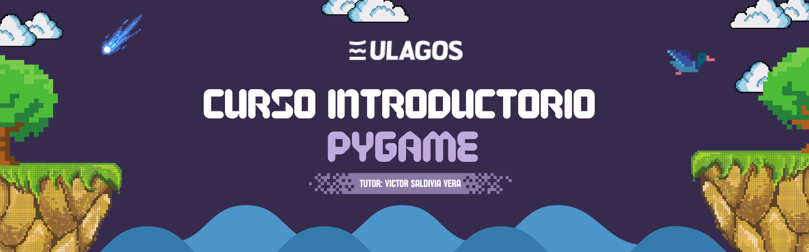

# Repositorio Curso Introductorio de Pygame

   
   

Este repositorio está diseñado para introducir a los estudiantes a la biblioteca Pygame. A lo largo del curso, se explicarán conceptos fundamentales e intermedios del uso de esta libería.

El objetivo final es que los estudiantes adquieran las bases necesarias para crear un videojuego simple, aplicando los principios de Programación Orientada a Objetos (POO).

El material de este repositorio, culminará con el desarrollo de un prototipo de videojuego en el que se aplicarán todos los conceptos aprendidos, como el manejo de ventanas de juego, interacción con el teclado, y animaciones básicas.

Se recomienda que antes de tomar este curso, sea necesario tener los conocimientos de Introduccíón a Python y de Programación Orientada a Objetos. Consulta aquí los repositorios: 
- [Repositorio Nivel Básico Python][repo-semestre-I]
- [Repositorio POO Python][repo-semestre-II]

## Enlaces de Interés

- Web oficial de Python [(Instalacion Python)][python]
- Documentación Pygame [(Documentación Oficial Pygame)][pygame]
- Visual Studio Code [(Editor de Texto)][vscode]

[python]: https://www.python.org/downloads/
[pygame]: https://www.pygame.org/docs/
[vscode]: https://code.visualstudio.com/download
[repo-semestre-I]: https://github.com/Vikktor93/python-semestre-I
[repo-semestre-II]: https://github.com/Vikktor93/poo-python

